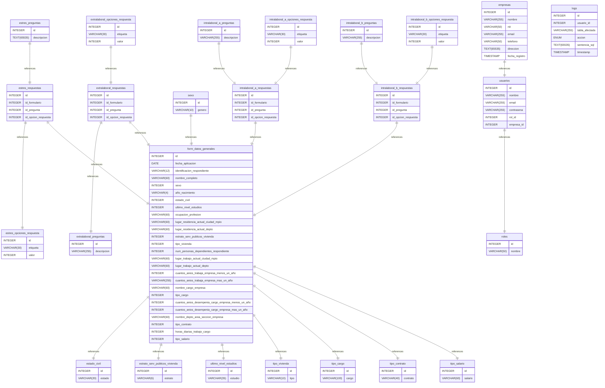

# E-R BAT_PSICOSOCIAL documentation
## Summary

- [Introduction](#introduction)
- [Database Type](#database-type)
- [Table Structure](#table-structure)
	- [empresas](#empresas)
	- [estado_civil](#estado_civil)
	- [estrato_serv_publicos_vivienda](#estrato_serv_publicos_vivienda)
	- [estres_opciones_respuesta](#estres_opciones_respuesta)
	- [estres_preguntas](#estres_preguntas)
	- [estres_respuestas](#estres_respuestas)
	- [form_datos_generales](#form_datos_generales)
	- [intralaboral_a_opciones_respuesta](#intralaboral_a_opciones_respuesta)
	- [intralaboral_a_preguntas](#intralaboral_a_preguntas)
	- [intralaboral_a_respuestas](#intralaboral_a_respuestas)
	- [intralaboral_b_opciones_respuesta](#intralaboral_b_opciones_respuesta)
	- [intralaboral_b_preguntas](#intralaboral_b_preguntas)
	- [intralaboral_b_respuestas](#intralaboral_b_respuestas)
	- [logs](#logs)
	- [roles](#roles)
	- [sexo](#sexo)
	- [tipo_cargo](#tipo_cargo)
	- [tipo_contrato](#tipo_contrato)
	- [tipo_salario](#tipo_salario)
	- [tipo_vivienda](#tipo_vivienda)
	- [ultimo_nivel_estudios](#ultimo_nivel_estudios)
	- [usuarios](#usuarios)
	- [extralaboral_opciones_respuesta](#extralaboral_opciones_respuesta)
	- [extralaboral_preguntas](#extralaboral_preguntas)
	- [extralaboral_respuestas](#extralaboral_respuestas)
- [Relationships](#relationships)
- [Database Diagram](#database-diagram)

## Introduction

## Database type

- **Database system:** MySQL
## Table structure

### empresas

| Name        | Type          | Settings                      | References                    | Note                           |
|-------------|---------------|-------------------------------|-------------------------------|--------------------------------|
| **id** | INTEGER | 🔑 PK, not null, unique, autoincrement | fk_empresas_id_usuarios | |
| **nombre** | VARCHAR(255) | not null |  | |
| **nit** | VARCHAR(50) | not null, unique |  | |
| **email** | VARCHAR(255) | not null |  | |
| **telefono** | VARCHAR(50) | not null |  | |
| **direccion** | TEXT(65535) | not null |  | |
| **fecha_registro** | TIMESTAMP | not null |  | | 

### estado_civil

| Name        | Type          | Settings                      | References                    | Note                           |
|-------------|---------------|-------------------------------|-------------------------------|--------------------------------|
| **id** | INTEGER | 🔑 PK, not null, unique, autoincrement |  | |
| **estado** | VARCHAR(20) | not null |  | | 

### estrato_serv_publicos_vivienda

| Name        | Type          | Settings                      | References                    | Note                           |
|-------------|---------------|-------------------------------|-------------------------------|--------------------------------|
| **id** | INTEGER | 🔑 PK, not null, unique, autoincrement |  | |
| **estrato** | VARCHAR(6) | not null |  | | 

### estres_opciones_respuesta

| Name        | Type          | Settings                      | References                    | Note                           |
|-------------|---------------|-------------------------------|-------------------------------|--------------------------------|
| **id** | INTEGER | 🔑 PK, not null, unique, autoincrement |  | |
| **etiqueta** | VARCHAR(30) | not null |  | |
| **valor** | INTEGER | not null |  | | 

### estres_preguntas

| Name        | Type          | Settings                      | References                    | Note                           |
|-------------|---------------|-------------------------------|-------------------------------|--------------------------------|
| **id** | INTEGER | 🔑 PK, not null, unique, autoincrement | fk_estres_preguntas_id_estres_respuestas | |
| **descripcion** | TEXT(65535) | not null |  | | 

### estres_respuestas

| Name        | Type          | Settings                      | References                    | Note                           |
|-------------|---------------|-------------------------------|-------------------------------|--------------------------------|
| **id** | INTEGER | 🔑 PK, not null, unique, autoincrement |  | |
| **id_formulario** | INTEGER | not null | fk_estres_respuestas_id_formulario_form_datos_generales | |
| **id_pregunta** | INTEGER | not null |  | |
| **id_opcion_respuesta** | INTEGER | not null | fk_estres_respuestas_id_opcion_respuesta_estres_opciones_respuesta | | 

### form_datos_generales

| Name        | Type          | Settings                      | References                    | Note                           |
|-------------|---------------|-------------------------------|-------------------------------|--------------------------------|
| **id** | INTEGER | 🔑 PK, not null, unique, autoincrement |  | |
| **fecha_aplicacion** | DATE | not null |  | |
| **identificacion_respondiente** | VARCHAR(12) | not null |  | |
| **nombre_completo** | VARCHAR(60) | not null |  | |
| **sexo** | INTEGER | not null |  | |
| **año_nacimiento** | VARCHAR(4) | not null |  | |
| **estado_civil** | INTEGER | not null | fk_form_datos_generales_estado_civil_estado_civil | |
| **ultimo_nivel_estudios** | INTEGER | not null | fk_form_datos_generales_ultimo_nivel_estudios_ultimo_nivel_estudios | |
| **ocupacion_profesion** | VARCHAR(60) | not null |  | |
| **lugar_residencia_actual_ciudad_mpio** | VARCHAR(60) | not null |  | |
| **lugar_residencia_actual_depto** | VARCHAR(60) | not null |  | |
| **estrato_serv_publicos_vivienda** | INTEGER | not null | fk_form_datos_generales_estrato_serv_publicos_vivienda_estrato_serv_publicos_vivienda | |
| **tipo_vivienda** | INTEGER | not null | fk_form_datos_generales_tipo_vivienda_tipo_vivienda | |
| **num_personas_dependientes_respondiente** | INTEGER | not null |  | |
| **lugar_trabajo_actual_ciudad_mpio** | VARCHAR(60) | not null |  | |
| **lugar_trabajo_actual_depto** | VARCHAR(60) | not null |  | |
| **cuantos_anios_trabaja_empresa_menos_un_año** | INTEGER | not null |  | |
| **cuantos_anios_trabaja_empresa_mas_un_año** | VARCHAR(255) | not null |  | |
| **nombre_cargo_empresa** | VARCHAR(60) | not null |  | |
| **tipo_cargo** | INTEGER | not null | fk_form_datos_generales_tipo_cargo_tipo_cargo | |
| **cuantos_anios_desempenia_cargo_empresa_menos_un_año** | INTEGER | not null |  | |
| **cuantos_anios_desempenia_cargo_empresa_mas_un_año** | INTEGER | not null |  | |
| **nombre_depto_area_seccion_empresa** | VARCHAR(60) | not null |  | |
| **tipo_contrato** | INTEGER | not null | fk_form_datos_generales_tipo_contrato_tipo_contrato | |
| **horas_diarias_trabajo_cargo** | INTEGER | not null |  | |
| **tipo_salario** | INTEGER | not null | fk_form_datos_generales_tipo_salario_tipo_salario | | 

### intralaboral_a_opciones_respuesta

| Name        | Type          | Settings                      | References                    | Note                           |
|-------------|---------------|-------------------------------|-------------------------------|--------------------------------|
| **id** | INTEGER | 🔑 PK, not null, unique, autoincrement | fk_intralaboral_a_opciones_respuesta_id_intralaboral_a_respuestas | |
| **etiqueta** | VARCHAR(30) | not null |  | |
| **valor** | INTEGER | not null |  | | 

### intralaboral_a_preguntas

| Name        | Type          | Settings                      | References                    | Note                           |
|-------------|---------------|-------------------------------|-------------------------------|--------------------------------|
| **id** | INTEGER | 🔑 PK, not null, unique, autoincrement | fk_intralaboral_a_preguntas_id_intralaboral_a_respuestas | |
| **descripcion** | VARCHAR(255) | not null |  | | 

### intralaboral_a_respuestas

| Name        | Type          | Settings                      | References                    | Note                           |
|-------------|---------------|-------------------------------|-------------------------------|--------------------------------|
| **id** | INTEGER | 🔑 PK, not null, unique, autoincrement |  | |
| **id_formulario** | INTEGER | not null | fk_intralaboral_a_respuestas_id_formulario_form_datos_generales | |
| **id_pregunta** | INTEGER | not null |  | |
| **id_opcion_respuesta** | INTEGER | not null |  | | 

### intralaboral_b_opciones_respuesta

| Name        | Type          | Settings                      | References                    | Note                           |
|-------------|---------------|-------------------------------|-------------------------------|--------------------------------|
| **id** | INTEGER | 🔑 PK, not null, unique, autoincrement | fk_intralaboral_b_opciones_respuesta_id_intralaboral_b_respuestas | |
| **etiqueta** | VARCHAR(30) | not null |  | |
| **valor** | INTEGER | not null |  | | 

### intralaboral_b_preguntas

| Name        | Type          | Settings                      | References                    | Note                           |
|-------------|---------------|-------------------------------|-------------------------------|--------------------------------|
| **id** | INTEGER | 🔑 PK, not null, unique, autoincrement | fk_intralaboral_b_preguntas_id_intralaboral_b_respuestas | |
| **descripcion** | VARCHAR(255) | not null |  | | 

### intralaboral_b_respuestas

| Name        | Type          | Settings                      | References                    | Note                           |
|-------------|---------------|-------------------------------|-------------------------------|--------------------------------|
| **id** | INTEGER | 🔑 PK, not null, unique, autoincrement | fk_intralaboral_b_respuestas_id_form_datos_generales | |
| **id_formulario** | INTEGER | not null |  | |
| **id_pregunta** | INTEGER | not null |  | |
| **id_opcion_respuesta** | INTEGER | not null |  | | 

### logs

| Name        | Type          | Settings                      | References                    | Note                           |
|-------------|---------------|-------------------------------|-------------------------------|--------------------------------|
| **id** | INTEGER | 🔑 PK, not null, unique, autoincrement |  | |
| **usuario_id** | INTEGER | not null |  | |
| **tabla_afectada** | VARCHAR(255) | not null |  | |
| **accion** | ENUM | not null |  | |
| **sentencia_sql** | TEXT(65535) | not null |  | |
| **timestamp** | TIMESTAMP | not null |  | | 

### roles

| Name        | Type          | Settings                      | References                    | Note                           |
|-------------|---------------|-------------------------------|-------------------------------|--------------------------------|
| **id** | INTEGER | 🔑 PK, not null, unique, autoincrement |  | |
| **nombre** | VARCHAR(50) | not null, unique |  | | 

### sexo

| Name        | Type          | Settings                      | References                    | Note                           |
|-------------|---------------|-------------------------------|-------------------------------|--------------------------------|
| **id** | INTEGER | 🔑 PK, not null, unique, autoincrement | fk_sexo_id_form_datos_generales | |
| **genero** | VARCHAR(10) | not null |  | | 

### tipo_cargo

| Name        | Type          | Settings                      | References                    | Note                           |
|-------------|---------------|-------------------------------|-------------------------------|--------------------------------|
| **id** | INTEGER | 🔑 PK, not null, unique, autoincrement |  | |
| **cargo** | VARCHAR(100) | not null |  | | 

### tipo_contrato

| Name        | Type          | Settings                      | References                    | Note                           |
|-------------|---------------|-------------------------------|-------------------------------|--------------------------------|
| **id** | INTEGER | 🔑 PK, not null, unique, autoincrement |  | |
| **contrato** | VARCHAR(40) | not null |  | | 

### tipo_salario

| Name        | Type          | Settings                      | References                    | Note                           |
|-------------|---------------|-------------------------------|-------------------------------|--------------------------------|
| **id** | INTEGER | 🔑 PK, not null, unique, autoincrement |  | |
| **salario** | VARCHAR(60) | not null |  | | 

### tipo_vivienda

| Name        | Type          | Settings                      | References                    | Note                           |
|-------------|---------------|-------------------------------|-------------------------------|--------------------------------|
| **id** | INTEGER | 🔑 PK, not null, unique, autoincrement |  | |
| **tipo** | VARCHAR(10) | not null |  | | 

### ultimo_nivel_estudios

| Name        | Type          | Settings                      | References                    | Note                           |
|-------------|---------------|-------------------------------|-------------------------------|--------------------------------|
| **id** | INTEGER | 🔑 PK, not null, unique, autoincrement |  | |
| **estudio** | VARCHAR(35) | not null |  | | 

### usuarios

| Name        | Type          | Settings                      | References                    | Note                           |
|-------------|---------------|-------------------------------|-------------------------------|--------------------------------|
| **id** | INTEGER | 🔑 PK, not null, unique, autoincrement |  | |
| **nombre** | VARCHAR(255) | not null |  | |
| **email** | VARCHAR(255) | not null, unique |  | |
| **contrasena** | VARCHAR(255) | not null |  | |
| **rol_id** | INTEGER | not null | fk_usuarios_rol_id_roles | |
| **empresa_id** | INTEGER | not null |  | | 

### extralaboral_opciones_respuesta

| Name        | Type          | Settings                      | References                    | Note                           |
|-------------|---------------|-------------------------------|-------------------------------|--------------------------------|
| **id** | INTEGER | 🔑 PK, not null, unique, autoincrement | fk_extralaboral_opciones_respuesta_id_extralaboral_respuestas | |
| **etiqueta** | VARCHAR(30) | not null |  | |
| **valor** | INTEGER | not null |  | | 

### extralaboral_preguntas

| Name        | Type          | Settings                      | References                    | Note                           |
|-------------|---------------|-------------------------------|-------------------------------|--------------------------------|
| **id** | INTEGER | 🔑 PK, not null, unique, autoincrement |  | |
| **descripcion** | VARCHAR(255) | not null |  | | 

### extralaboral_respuestas

| Name        | Type          | Settings                      | References                    | Note                           |
|-------------|---------------|-------------------------------|-------------------------------|--------------------------------|
| **id** | INTEGER | 🔑 PK, not null, unique, autoincrement | fk_extralaboral_respuestas_id_form_datos_generales | |
| **id_formulario** | INTEGER | not null |  | |
| **id_pregunta** | INTEGER | not null | fk_extralaboral_respuestas_id_pregunta_extralaboral_preguntas | |
| **id_opcion_respuesta** | INTEGER | not null |  | | 

## Relationships

- **estres_preguntas to estres_respuestas**: one_to_one
- **estres_respuestas to estres_opciones_respuesta**: one_to_one
- **form_datos_generales to estado_civil**: one_to_one
- **form_datos_generales to estrato_serv_publicos_vivienda**: one_to_one
- **estres_respuestas to form_datos_generales**: one_to_one
- **extralaboral_respuestas to extralaboral_preguntas**: one_to_one
- **extralaboral_opciones_respuesta to extralaboral_respuestas**: one_to_one
- **extralaboral_respuestas to form_datos_generales**: one_to_one
- **sexo to form_datos_generales**: one_to_one
- **form_datos_generales to ultimo_nivel_estudios**: one_to_one
- **form_datos_generales to tipo_vivienda**: one_to_one
- **form_datos_generales to tipo_cargo**: one_to_one
- **form_datos_generales to tipo_contrato**: one_to_one
- **form_datos_generales to tipo_salario**: one_to_one
- **intralaboral_a_preguntas to intralaboral_a_respuestas**: one_to_one
- **intralaboral_a_opciones_respuesta to intralaboral_a_respuestas**: one_to_one
- **intralaboral_a_respuestas to form_datos_generales**: one_to_one
- **intralaboral_b_preguntas to intralaboral_b_respuestas**: one_to_one
- **intralaboral_b_opciones_respuesta to intralaboral_b_respuestas**: one_to_one
- **intralaboral_b_respuestas to form_datos_generales**: one_to_one
- **empresas to usuarios**: one_to_one
- **usuarios to roles**: one_to_one

## Database Diagram

